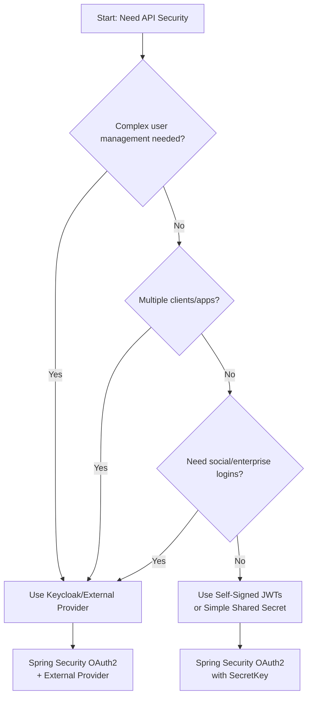

Great question! You **absolutely DON'T need Keycloak** to use Spring Security OAuth2 Resource Server. My previous examples with Keycloak were because your initial configuration mentioned it, but let me clarify the alternatives.

## The Core Principle

**Spring Security OAuth2 Resource Server works with ANY standards-compliant OAuth2/OpenID Connect provider.** The key requirement is having a JWT token from *somewhere* that can be validated against a public key (JWKS endpoint) or shared secret.

## Options Without Keycloak

Here are the most common alternatives:

| **Provider Type** | **Example Providers** | **Use Case** |
|-------------------|----------------------|--------------|
| **Cloud Identity Providers** | Auth0, Okta, Azure AD, AWS Cognito, Google Identity | Production apps, enterprise SSO |
| **Self-hosted OIDC** | Ory Hydra, Dex, Gluu, Simple OIDC | Full control, on-premises deployment |
| **Test/Mock Providers** | MockOIDC, WireMock, in-memory testing | Development/testing only |
| **No External Provider** | Self-signed JWTs for testing | Simple development setup |

## Simplest Approach: Development with Self-Signed JWTs

For development/testing without any external provider, here's the simplest setup:

### 1. Update Security Configuration

```java
package jaeger.de.miel.TodoAPI;

import org.springframework.context.annotation.Bean;
import org.springframework.context.annotation.Configuration;
import org.springframework.security.config.annotation.web.builders.HttpSecurity;
import org.springframework.security.config.annotation.web.configuration.EnableWebSecurity;
import org.springframework.security.oauth2.jwt.JwtDecoder;
import org.springframework.security.oauth2.jwt.NimbusJwtDecoder;
import org.springframework.security.web.SecurityFilterChain;

import javax.crypto.SecretKey;
import javax.crypto.spec.SecretKeySpec;
import java.util.Base64;

@Configuration
@EnableWebSecurity
public class SecurityConfig {

    @Bean
    public SecurityFilterChain filterChain(HttpSecurity http) throws Exception {
        http
                .authorizeHttpRequests(authz -> authz
                        .requestMatchers("/api/public/**").permitAll()
                        .requestMatchers("/api/admin/**").hasRole("ADMIN")
                        .anyRequest().authenticated()
                )
                .oauth2ResourceServer(oauth2 -> oauth2
                        .jwt(jwt -> jwt.decoder(jwtDecoder()))
                );
        return http.build();
    }

    @Bean
    public JwtDecoder jwtDecoder() {
        // For development: Use a shared secret instead of external provider
        String secret = "mySuperSecretKeyThatIsAtLeast32BytesLong123!";
        byte[] decodedKey = Base64.getDecoder().decode(
            Base64.getEncoder().encodeToString(secret.getBytes())
        );
        SecretKey key = new SecretKeySpec(decodedKey, 0, decodedKey.length, "HmacSHA256");
        
        return NimbusJwtDecoder.withSecretKey(key).build();
    }
}
```

### 2. Create a Token Generator Utility

```java
package jaeger.de.miel.TodoAPI.util;

import io.jsonwebtoken.Jwts;
import io.jsonwebtoken.security.Keys;
import org.springframework.stereotype.Component;

import javax.crypto.SecretKey;
import java.time.Instant;
import java.util.Date;
import java.util.HashMap;
import java.util.Map;
import java.util.UUID;

@Component
public class JwtTokenGenerator {
    
    private final SecretKey key;
    
    public JwtTokenGenerator() {
        // Same secret as in SecurityConfig
        String secret = "mySuperSecretKeyThatIsAtLeast32BytesLong123!";
        this.key = Keys.hmacShaKeyFor(secret.getBytes());
    }
    
    public String generateUserToken(String username) {
        return generateToken(username, new String[]{"USER"});
    }
    
    public String generateAdminToken(String username) {
        return generateToken(username, new String[]{"USER", "ADMIN"});
    }
    
    private String generateToken(String username, String[] roles) {
        Map<String, Object> claims = new HashMap<>();
        claims.put("roles", roles);
        claims.put("preferred_username", username);
        claims.put("email", username + "@example.com");
        
        return Jwts.builder()
                .claims(claims)
                .subject(username)
                .id(UUID.randomUUID().toString())
                .issuedAt(Date.from(Instant.now()))
                .expiresAt(Date.from(Instant.now().plusSeconds(3600))) // 1 hour
                .issuer("todo-api")
                .signWith(key)
                .compact();
    }
}
```

### 3. Create a Public Token Endpoint for Testing

```java
package jaeger.de.miel.TodoAPI.controller;

import jaeger.de.miel.TodoAPI.util.JWTTokenGenerator;
import org.springframework.web.bind.annotation.*;

import java.util.Map;

@RestController
@RequestMapping("/api/public/tokens")
public class TokenController {

    private final JWTTokenGenerator tokenGenerator;

    public TokenController(JWTTokenGenerator tokenGenerator) {
        this.tokenGenerator = tokenGenerator;
    }

    @GetMapping("/user")
    public Map<String, String> getUserToken() {
        String token = tokenGenerator.generateUserToken("testuser");
        return Map.of("token", token, "message", "Use for USER endpoints");
    }

    @GetMapping("/admin")
    public Map<String, String> getAdminToken() {
        String token = tokenGenerator.generateAdminToken("testadmin");
        return Map.of("token", token, "message", "Use for ADMIN endpoints");
    }
}
```

### 4. Updated CURL Commands (No External Provider Needed)

```bash
# 1. Get a test user token directly from your API
curl http://localhost:8080/api/public/tokens/user

# Response: {"token":"eyJhbGciOiJIUzI1NiIsInR5cCI6IkpXVCJ9...", "message":"Use for USER endpoints"}

# 2. Test public endpoint (no token)
curl http://localhost:8080/api/public/hello

# 3. Test authenticated endpoint with user token
USER_TOKEN=$(curl -s http://localhost:8080/api/public/tokens/user | jq -r '.token')
curl -H "Authorization: Bearer $USER_TOKEN" http://localhost:8080/api/todos

# 4. Get admin token and test admin endpoint
ADMIN_TOKEN=$(curl -s http://localhost:8080/api/public/tokens/admin | jq -r '.token')
curl -H "Authorization: Bearer $ADMIN_TOKEN" http://localhost:8080/api/admin/dashboard
```

## When DO You Need Keycloak (or Similar)?

You would choose Keycloak when you need:

| **Requirement** | **Solution** |
|-----------------|--------------|
| User management UI | Keycloak Admin Console |
| Multiple applications sharing login | OIDC SSO |
| Social login (Google, GitHub, etc.) | Keycloak identity brokers |
| Enterprise LDAP/AD integration | Keycloak user federation |
| Advanced authentication flows | Step-up auth, 2FA, WebAuthn |

## Decision Flow: Do You Need an External Provider?



## Complete Minimal Setup (No External Dependencies)

### application.yml
```yaml
server:
  port: 8080

spring:
  application:
    name: todo-api
  
  security:
    oauth2:
      resourceserver:
        jwt:
          # No external provider needed for development
          issuer-uri: todo-api
```

### Add JWT Dependencies to pom.xml
```xml
<dependency>
    <groupId>io.jsonwebtoken</groupId>
    <artifactId>jjwt-api</artifactId>
    <version>0.12.5</version>
</dependency>
<dependency>
    <groupId>io.jsonwebtoken</groupId>
    <artifactId>jjwt-impl</artifactId>
    <version>0.12.5</version>
    <scope>runtime</scope>
</dependency>
<dependency>
    <groupId>io.jsonwebtoken</groupId>
    <artifactId>jjwt-jackson</artifactId>
    <version>0.12.5</version>
    <scope>runtime</scope>
</dependency>
```

## Summary

**You don't need Keycloak for:**
- Internal APIs
- Microservices communication
- Development/testing
- Simple applications without user management UI needs
- When you just need to validate tokens, not issue them

**Use Keycloak when you need:**
- A full-featured identity provider
- User registration/login UI
- Social login integration
- Enterprise SSO
- Centralized user management across multiple apps

For your TodoAPI example, if it's just a simple API, you can absolutely use the self-signed JWT approach without any external provider. The Spring Security OAuth2 Resource Server just needs to validate tokens - it doesn't care where they come from.

Would you like me to show you a complete example using a different provider like Auth0, or stick with the simple self-signed approach?